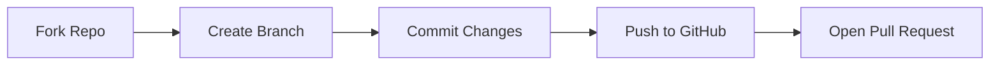

<p align="center">
  
  
  <h1 align="center">
    <span style="display: inline-block; animation: bounce 2s infinite;">✨</span> 
    <span style="background: linear-gradient(45deg, #ee4623, #8a2be2); -webkit-background-clip: text; color: transparent; text-shadow: 0 0 8px rgba(238,70,35,0.3);">CMS Project CI3</span> 
    <span style="display: inline-block; animation: bounce 2s infinite 0.2s;">✨</span>
  </h1>
  
  <p align="center" style="font-size: 1.1em;">
    <b>A dynamic CMS with</b> 
    <span class="animated-text" style="display: inline-block;">
      <span style="animation: rotateWords 12s infinite 0s;">Admin Dashboard</span>
      <span style="animation: rotateWords 12s infinite 3s;">User Auth</span>
      <span style="animation: rotateWords 12s infinite 6s;">Page Builder</span>
      <span style="animation: rotateWords 12s infinite 9s;">Media Manager</span>
    </span>
  </p>
  
  <p align="center">
    <a href="https://github.com/shivam-mishra-iphtech/CMS_project_CI3/tree/main">
      
    </a>
    
  </p>
</p>

---

## 🎮 Interactive Demo

<table align="center">
  <tr>
    <td align="center">
      <a href="https://drive.google.com/file/d/1SzEDDVwPDM1QkEgQ6UfvGGlYX2a1qhxC/view">
        
        <br>
        <b>🔥 Dashboard Preview</b>
      </a>
    </td>
    <td align="center">
      <a href="https://drive.google.com/file/d/1zgS-KqJogf6h591KBJH97heYptuDfPOD/view">
        
        <br>
        <b>📝 Page Editor</b>
      </a>
    </td>
  </tr>
</table>

---

## 🌈 Features Galaxy

<div align="center" style="display: grid; grid-template-columns: repeat(auto-fit, minmax(250px, 1fr)); gap: 1.5rem; margin: 2rem 0;">

```feature-card

### Secure Authentication
- Role-based access control
- Password encryption
- Session management
```

```feature-card

### Content Management
- WYSIWYG editor
- SEO-friendly URLs
- Draft/Publish system
```

```feature-card

### Media Manager
- Drag & drop uploads
- File type validation
- Thumbnail generation
```

</div>

---

## 🛠️ Tech Stack Superpowers

<div align="center">
  
  
  
  
</div>

---

## 🚀 Quick Start

```bash
# Clone with SSH
git clone git@github.com:shivam-mishra-iphtech/CMS_project_CI3.git

# Or with HTTPS
git clone https://github.com/shivam-mishra-iphtech/CMS_project_CI3.git
```

1. **Configure** `application/config/database.php`
2. **Import** SQL file from `database/`
3. **Access** `http://localhost/cms_project`

---

## 📸 Screenshot Carousel

<div align="center" style="overflow-x: auto; white-space: nowrap; padding: 1rem 0;">
  
  
  
  
</div>

---

## 🤝 Contribute Like a Pro



---

<p align="center">
  
</p>

<style>
  @keyframes bounce {
    0%, 100% { transform: translateY(0); }
    50% { transform: translateY(-10px); }
  }
  @keyframes rotateWords {
    0%, 20% { opacity: 0; transform: translateY(-10px); }
    5%, 15% { opacity: 1; transform: translateY(0); }
  }
  .feature-card {
    background: linear-gradient(145deg, #f8f9fa, #e9ecef);
    padding: 1.5rem;
    border-radius: 12px;
    box-shadow: 0 6px 12px rgba(0,0,0,0.05);
    transition: all 0.3s ease;
  }
  .feature-card:hover {
    transform: translateY(-5px);
    box-shadow: 0 12px 20px rgba(0,0,0,0.1);
  }
</style>
```
